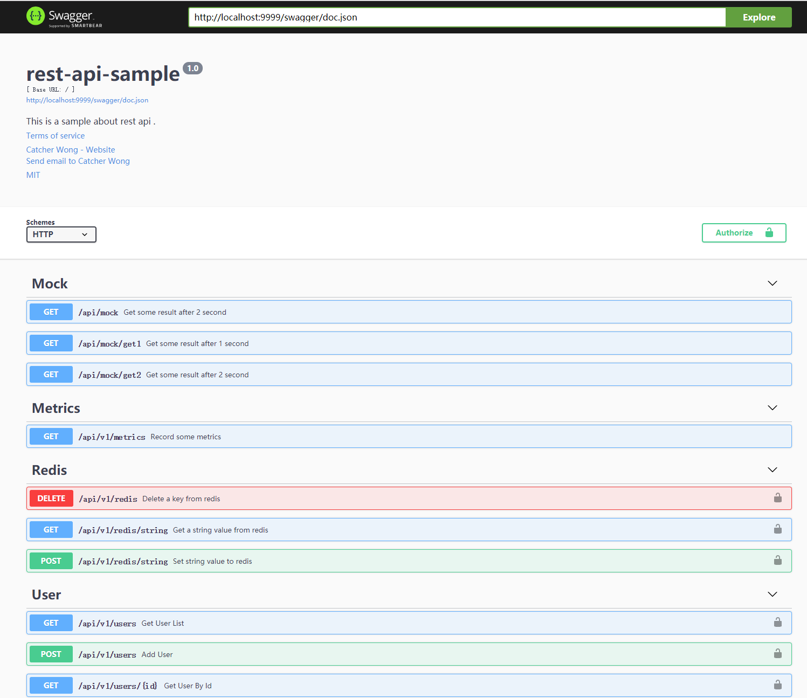

# rest-api-sample

A simple sample that use gin to build rest api.


## Installation

```
git clone https://github.com/catcherwong/rest-api-sample.git
```

## How to run

```
$ cd rest-api-sample

$ go run main.go 
```

Swagger doc




## Features

- Gin
- Gorm
- Swagger
- Redis
- SQLite
- yaml
- prometheus